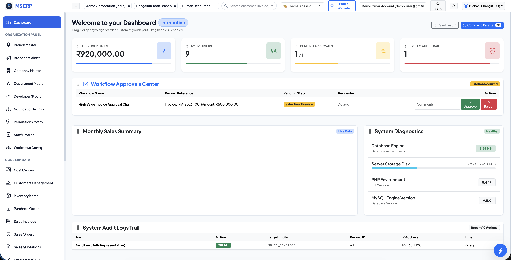

<div align="center">

# 🚀 MS ERP — Free Open-Source Enterprise Platform

<p align="center">
  <strong>The Next-Generation Free & Open-Source ERP System powered by Laravel, PHP 8.3+, MySQL, Dynamic Metadata Engine, Low-Code Developer Studio, and 5 Visual Theme Engines.</strong>
</p>

[](https://laravel.com)
[](https://php.net)
[](https://mysql.com)
[](https://vitejs.dev)
[](LICENSE)
[](https://github.com/Moin-shadab/mserp)

<br/>

<p align="center">
  
</p>

</div>

---

## 🔍 Key Features & Capabilities

**MS ERP (`mserp`)** is a powerful, production-ready **Free Open-Source Enterprise Resource Planning (ERP)** software built to automate business operations, GST billing, financial accounting, inventory, CRM, email communications, and internal team chat. 

Unlike legacy ERP software that requires complex code rewrites to add new modules, **MS ERP is driven by a Low-Code Dynamic Metadata Architecture**. Form schemas, data grids, menu items, permissions, theme settings, and dashboard layouts are stored directly in MySQL and managed dynamically via **Developer Studio**.

---

## ✨ Features Breakdown

### 🎨 5 MySQL-Persisted Visual Theme Engines
Switch instantly between 5 curated visual design systems, persisted to your MySQL user profile:
1. 🎨 **Classic Enterprise**: Ultra-clean professional light interface.
2. ⚡ **Neo-Brutalism**: High-contrast brutalist borders, hard offset shadows (`3px 3px 0 #000`), and bold accents.
3. 🪵 **Skeuomorphism**: Tactile 3D physical glass buttons, metallic bevels, and embossed card depth.
4. ⚪ **Neomorphism**: Soft UI relief dual-shadow inset/outset design system.
5. 💥 **Maximalist Studio**: Spotify Wrapped & Figma Conf inspired creative aesthetic, featuring deep dark violet backgrounds, electric Hot Magenta (#ec4899) & Neon Cyan (#06b6d4) gradient cards, bold typography, and hyper-vibrant status badges.

### 🛠️ Low-Code / No-Code Developer Module Studio
- **Instant CRUD Generator**: Build new modules and pages directly from SQL queries or MySQL tables without writing boilerplate controllers or views.
- **3-File Architecture**: Auto-generates clean, isolated `main.blade.php`, `css.blade.php`, and `js.blade.php` files for maximum maintainability.
- **5-Minute Performance Cache**: Auto-discovers and caches dynamic module registrations to ensure **0ms filesystem overhead**.

### ⚡ Enterprise Security & High-Volume Optimization
- **Rate Limiting & Brute-Force Protection**: Stops `/login` password attacks with strict 5-attempt thresholds while granting active users high burst limits (1,000 req/min).
- **System Token & Backup Exemption**: Automated backup scripts, CLI tools, and data import jobs with System API Keys bypass rate limits (`Limit::none()`) for unlimited throughput.
- **Bulk Processing Engine (`/api/bulk/process`)**: Ingests arrays of up to 5,000 rows in single-transaction SQL queries, turning 100,000 individual requests into ~20 queries (**99.5% CPU & memory reduction**).

### 🎯 Drag & Drop Dashboard Customizer
- **Interactive Reordering**: Drag KPI cards and widgets with visual grip handles.
- **Dual Persistence**: Order settings are saved automatically to MySQL (`users` table) and `localStorage`.

### ⌘ Universal Command Palette (`Cmd + K` / `Ctrl + K`)
- Search any module, invoice, customer, report, or system action instantly using keyboard shortcuts.

### 📊 GST Billing & Dynamic Reporting Engine
- Purchase Orders, Sales Quotations, Invoices, Purchase Bills, GST Taxes (CGST, SGST, IGST), UOMs, Customer/Vendor Ledgers, and custom SQL analytics exportable to Excel/PDF.

### ✉️ Enterprise Email Client & Team Chat Hub
- Integrated SMTP/IMAP multi-account email client with thread management and internal team chat channels.

---

## ⚡ 1-Command Automated Setup (Mac, Linux & Windows)

### 🚀 Quick Start (One Command)

```bash
# macOS / Linux
git clone https://github.com/Moin-shadab/mserp.git
cd mserp
./setup.sh
```

```cmd
:: Windows Command Prompt / PowerShell
git clone https://github.com/Moin-shadab/mserp.git
cd mserp
setup.bat
```

The interactive installer will:
1. Copy `.env` automatically.
2. Ask for your MySQL credentials (Host, Port, Database Name, User, Password).
3. **Automatically connect to MySQL and create the database if missing**.
4. Generate security keys (`APP_KEY`).
5. Run migrations & seed initial ERP metadata, default settings, and demo user accounts.
6. Install NPM packages and compile Vite production assets.

---

## 🌐 Virtual Host Setup Guide (Apache & Nginx for All OS)

To run MS ERP under a clean local domain (e.g. `http://erp.local` or `http://mserp.test`) without `php artisan serve`, follow the virtual host configurations below:

### 🌐 Step 1: Add Local Domain to Hosts File

####  macOS & 🐧 Linux Hosts Setup
Open `/etc/hosts` in terminal:
```bash
sudo nano /etc/hosts
```
Add line:
```hosts
127.0.0.1   erp.local
```

#### 🪟 Windows Hosts Setup
Open Notepad as Administrator and open file: `C:\Windows\System32\drivers\etc\hosts`
Add line:
```hosts
127.0.0.1   erp.local
```

---

### 🟢 1. Nginx Virtual Host Setup

#### 🐧 Ubuntu / Linux Nginx Configuration
Create file `/etc/nginx/sites-available/mserp`:
```nginx
server {
    listen 80;
    server_name erp.local;
    root /var/www/mserp/public;

    index index.php index.html;
    charset utf-8;

    location / {
        try_files $uri $uri/ /index.php?$query_string;
    }

    location = /favicon.ico { access_log off; log_not_found off; }
    location = /robots.txt  { access_log off; log_not_found off; }

    error_page 404 /index.php;

    location ~ \.php$ {
        fastcgi_pass unix:/var/run/php/php8.3-fpm.sock;
        fastcgi_param SCRIPT_FILENAME $realpath_root$fastcgi_script_name;
        include fastcgi_params;
    }

    location ~ /\.ht {
        deny all;
    }
}
```
Enable site & reload Nginx:
```bash
sudo ln -s /etc/nginx/sites-available/mserp /etc/nginx/sites-enabled/
sudo nginx -t
sudo systemctl restart nginx
```

####  macOS Homebrew Nginx Configuration
Create `/opt/homebrew/etc/nginx/servers/mserp.conf`:
```nginx
server {
    listen 80;
    server_name erp.local;
    root /Users/YOUR_USERNAME/Sites/erp/public;

    index index.php index.html;

    location / {
        try_files $uri $uri/ /index.php?$query_string;
    }

    location ~ \.php$ {
        fastcgi_pass 127.0.0.1:9000;
        fastcgi_index index.php;
        fastcgi_param SCRIPT_FILENAME $realpath_root$fastcgi_script_name;
        include fastcgi_params;
    }
}
```
Restart Nginx:
```bash
brew services restart nginx
```

---

### 🔴 2. Apache Virtual Host Setup

#### 🐧 Ubuntu / Linux Apache Configuration
Create `/etc/apache2/sites-available/mserp.conf`:
```apache
<VirtualHost *:80>
    ServerName erp.local
    ServerAdmin webmaster@localhost
    DocumentRoot /var/www/mserp/public

    <Directory /var/www/mserp/public>
        Options Indexes FollowSymLinks
        AllowOverride All
        Require all granted
    </Directory>

    ErrorLog ${APACHE_LOG_DIR}/mserp_error.log
    CustomLog ${APACHE_LOG_DIR}/mserp_access.log combined
</VirtualHost>
```
Enable rewrite module & site:
```bash
sudo a2enmod rewrite
sudo a2ensite mserp.conf
sudo systemctl restart apache2
```

####  macOS Apache Configuration
Create `/etc/apache2/other/mserp.conf`:
```apache
<VirtualHost *:80>
    ServerName erp.local
    DocumentRoot "/Users/YOUR_USERNAME/Sites/erp/public"
    
    <Directory "/Users/YOUR_USERNAME/Sites/erp/public">
        Options Indexes FollowSymLinks Multiviews
        AllowOverride All
        Require all granted
    </Directory>
</VirtualHost>
```
Restart Apache:
```bash
sudo apachectl restart
```

#### 🪟 Windows XAMPP Apache Configuration
Open `C:\xampp\apache\conf\extra\httpd-vhosts.conf` and add:
```apache
<VirtualHost *:80>
    DocumentRoot "C:/xampp/htdocs/mserp/public"
    ServerName erp.local
    <Directory "C:/xampp/htdocs/mserp/public">
        AllowOverride All
        Require all granted
    </Directory>
</VirtualHost>
```
Restart Apache from XAMPP Control Panel.

#### 🪟 Windows Laragon
Laragon automatically creates virtual hosts! Simply move the `mserp` directory into `C:\laragon\www\mserp` and open `http://mserp.test` in your browser.

---

## ⚡ Seeded Demo Login Credentials

After running `setup.sh` or `php artisan erp:setup`, default accounts are seeded (Password for all: `password`):

| Role Title | Email Address | Access Scope |
| :--- | :--- | :--- |
| **🛡️ CFO / Super Admin** | `admin@mserp.com` | Unrestricted Full System Access & Developer Studio |
| **📈 Sales Head** | `north.head@mserp.com` | Department Supervisor & Sales Operations |
| **💰 Finance Head** | `accounts.head@mserp.com` | Financial Ledgers & Approvals |
| **💼 Sales Representative** | `rep.north1@mserp.com` | Customer Accounts & Invoicing |
| **📝 Accounts Member** | `accounts.member@mserp.com` | Receipts & Billing |
| **👤 General User** | `user@mserp.com` | Read-only Workspace Access |

---

## 🔍 How to Make This Repository Rank High on GitHub & Google

To ensure **MS ERP** appears at the top of Google & GitHub searches for keywords like `free erp`, `open source erp`, `mserp`, and `laravel erp`:

### 1. Configure GitHub Repository Topics
Go to repository page on GitHub (`https://github.com/Moin-shadab/mserp`):
1. Click the ⚙️ gear icon next to **"About"** on the right sidebar.
2. Under **Description**, set:
   > `MS ERP — Next-Generation Free Open-Source Enterprise Platform powered by Laravel, MySQL, Low-Code Developer Studio, and Multi-Theme System.`
3. Under **Topics**, add these exact tags:
   `erp`, `open-source-erp`, `free-erp`, `mserp`, `laravel-erp`, `developer-studio`, `low-code-erp`, `enterprise-resource-planning`, `accounting-software`, `inventory-management`, `billing-software`, `ag-grid`, `bootstrap5`, `php8`
4. Save changes.

---

## 🏛️ System Architecture

```
┌─────────────────────────────────────────────────────────────┐
│                   DYNAMIC METADATA ARCHITECTURE             │
├───────────────┬────────────────┬──────────────┬─────────────┤
│ modules       │ submodules     │ pages        │ system_     │
│               │                │              │ settings    │
├───────────────┼────────────────┼──────────────┼─────────────┤
│ users         │ roles          │ role_        │ user_       │
│               │                │ permissions  │ permissions │
├───────────────┼────────────────┼──────────────┼─────────────┤
│ sales_invoices│ purchase_orders│ customers    │ vendors     │
└───────────────┴────────────────┴──────────────┴─────────────┘
```

---

## 🤝 Contributing

Contributions, issues, and feature requests are welcome! Feel free to check the [issues page](https://github.com/Moin-shadab/mserp/issues).

---

## 📜 License

Distributed under the **MIT License**. See `LICENSE` for details.

<div align="center">
  <sub>Built with ❤️ by the MS ERP Engineering Team. Powered by Laravel, PHP 8.3+, Bootstrap 5, Vite, & MySQL.</sub>
</div>