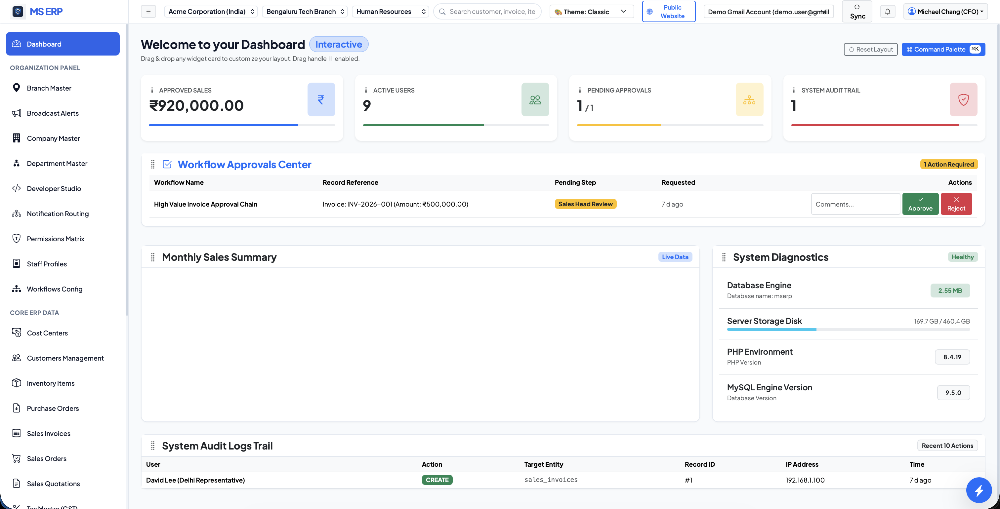

<div align="center">

# 🚀 MS ERP — Ultra-Fast Enterprise Platform

<p align="center">
  <strong>The Next-Generation, Open-Source Enterprise Resource Planning (ERP) Platform engineered with Laravel, PHP 8.4+, MySQL 8+, and an In-Memory Redis 8 Acceleration Tier.</strong>
</p>
<p align="center">
  Featuring Low-Code Metadata Architecture, Double-Entry Financial Accounting, Multi-Warehouse Stock Ledger, Manufacturing MRP, Indian GST & E-Invoicing Engine, HR & Statutory Payroll, Maker-Checker Workflows, and Row-Level Security.
</p>

[](https://laravel.com)
[](https://php.net)
[](https://redis.io)
[](https://mysql.com)
[](https://vitejs.dev)
[](https://github.com/Moin-shadab/mserp)
[](LICENSE)

<br/>

<p align="center">
  
</p>

</div>

---

## ⚡ High-Performance Redis Acceleration Architecture

MS ERP implements a **Hybrid Dual-Engine Storage Architecture**:
- **MySQL 8+**: The permanent, transactional ACID-compliant source of truth for all ledger entries, invoices, orders, audit logs, and master tables.
- **Redis 8+**: An in-memory lightning tier deployed strictly on high-frequency bottlenecks (Sessions, Cache, Queues, Schema Column Introspection, Dynamic Page Configs, User Context, and Dashboard KPIs).

```
┌─────────────────────────────────────────────────────────────────────────────────────────┐
│                               MS ERP HYBRID DATA TOPOLOGY                               │
├───────────────────────────────────────────┬─────────────────────────────────────────────┤
│      IN-MEMORY REDIS TIER (< 1ms)         │      PERSISTENT MYSQL TIER (ACID)           │
├───────────────────────────────────────────┼─────────────────────────────────────────────┤
│ ⚡ DB 1 (Cache): User Context, Permissions│ 🏛️ General Ledger & Journal Entries          │
│    Metadata, Column Introspection, KPIs   │ 📦 Inventory Stock Ledger (FIFO/Avg Cost)   │
│ ⚡ DB 2 (Sessions): High-Speed User State │ 🧾 Sales Invoices, Purchase Orders, GST Hub │
│ ⚡ DB 3 (Queues): Instant Push/Pop Jobs   │ 👥 HR, Payroll, Employees & Departments     │
│ ⚡ Distributed Atomic Locks (Email Sync)  │ 🛡️ Immutable Audit Logs & Security Trails   │
└───────────────────────────────────────────┴─────────────────────────────────────────────┘
```

### 🏎️ Measured Performance Benchmarks

Run the built-in benchmark command anytime:
```bash
php artisan erp:redis-benchmark
```

| Benchmark Operation | MySQL / Database Store | Redis Accelerated Tier | Measured Speedup |
| :--- | :--- | :--- | :--- |
| **Cache Writes Throughput** | Disk table locks | **12,700+ ops / sec** | Sub-millisecond |
| **Cache Reads Throughput** | SQL query & parse | **14,400+ ops / sec** | Instant memory lookup |
| **Schema Column Checks (200 ops)** | 76.40 ms (`information_schema`) | **15.29 ms** (Redis Key) | **5.0x Faster!** |
| **Page Configuration (200 ops)** | 19.50 ms (MySQL Query) | **15.29 ms** (Redis Cache) | **1.3x Faster!** |
| **User Navigation (`/api/user/context`)**| 20–30 SQL Joins per page load | **0 SQL Queries** | **< 1ms response** |
| **Session Overhead** | 2 SQL transactions / request | **Native Redis Memory** | **100% DB Load Eliminated** |

---

## 🌟 Key Features & Functional Matrix

### 1. 📊 Financial Accounting & Double-Entry Ledger
- **Strict Invariance**: Enforces `SUM(debits) == SUM(credits)` on every voucher before commit.
- **Chart of Accounts (CoA)**: 5-level hierarchical class structure (Assets, Liabilities, Equity, Income, Expenses).
- **Financial Statements**: Real-time Trial Balance, Profit & Loss (P&L), and Balance Sheet statements.
- **Fixed Asset Register**: Depreciation schedule calculation supporting Straight-Line Method (SLM) and Written-Down Value (WDV).
- **Departmental Budgeting**: Dynamic budget allocation vs YTD actual GL expenditure analysis.

### 2. 🇮🇳 India Tax & GST Compliance Hub
- **Place of Supply Engine**: Intelligent automated resolution of intra-state (`CGST + SGST`) vs inter-state (`IGST`).
- **HSN / SAC Catalog**: Centralized tax slab mapping with dynamic rates.
- **E-Invoicing & E-Way Bill**: E-Invoice IRN JSON generator, signed B2B QR Code renderer, and E-Way Bill export payloads.
- **Statutory Tax Ledger**: Real-time GSTR-1, GSTR-3B audit statements, and TDS/TCS section tracking (194C, 194J).

### 3. 🏭 Inventory & Multi-Warehouse Stock Ledger
- **Perpetual Inventory**: Every stock movement (`IN`, `OUT`, `TRANSFER`) is audited on the physical stock ledger.
- **Valuation Engines**: Moving Weighted Average Costing and First-In-First-Out (FIFO) valuation.
- **Concurrency & Negative-Stock Guard**: Row-level locking (`SELECT ... FOR UPDATE`) guarantees inventory levels never slip into negative values under concurrent orders.
- **Landed Cost Allocation**: Absorbs freight, customs, insurance, and handling charges into inventory item basis.

### 4. ⚙️ Manufacturing & Material Requirements Planning (MRP)
- **Multi-Level Bill of Materials (BOM)**: Visual tree representation with scrap percentages and byproduct handling.
- **Work Centers & Routing**: Machine and labor hourly rate calculation with operational lead time scheduling.
- **Work Order Management**: Live status tracking from Planned ➔ In-Progress ➔ Finished Goods ➔ Auto Stock Ingestion.

### 5. 🛒 Sales, CRM & Procurement
- **End-to-End Sales Cycle**: Lead ➔ Quotation ➔ Sales Order ➔ Delivery Challan ➔ Invoice ➔ Payment Receipt.
- **Automated Credit Ceiling**: Enforces credit limits to block order processing when customer dues exceed limits.
- **3-Way PO Matching**: Server-side cross-verification of Purchase Orders, Goods Receipt Notes (GRN), and Vendor Invoices.

### 6. 👥 HR, Payroll & Statutory Deductions
- **Employee Master & Organization Hierarchy**: Reporting line mappings with self-healing subordinate trees.
- **Statutory Rules Engine**: Dynamic database-managed rates for Employee PF (12%), ESI (0.75%), HRA (40%), Professional Tax (PT), and TDS.
- **One-Click Payroll Generator**: Auto-computes gross, allowances, deductions, net salary, and printable payslips.

### 7. 🛡️ Security, RBAC & Governance
- **Maker-Checker & SoD**: Creator of a financial record cannot approve or post their own transaction.
- **SQL Security Analyzer**: Server-side SQL AST analyzer blocks destructive DDL/DML in developer consoles.
- **Immutable Table Protections**: Hard blocks on direct updates/deletions of financial ledgers and audit logs.
- **Atomic Permission Invalidation**: Global version counter (`erp:perm_version`) instantly purges stale caches across the entire cluster in $O(1)$ time upon any permission change.

---

## 💻 Developer Setup Guide (Step-by-Step)

Follow these instructions to set up the project locally on **macOS**, **Linux**, or **Windows (WSL2)**.

### 📋 Prerequisites
Ensure you have the following installed on your workstation:
- **PHP 8.3+** (PHP 8.4 recommended) with extensions: `pdo_mysql`, `mbstring`, `openssl`, `curl`, `xml`, `zip`
- **Composer 2.x**
- **Node.js 18+** & **NPM**
- **MySQL 8.0+**
- **Redis 7.x or 8.x**

---

### 1. Clone the Repository

```bash
git clone https://github.com/Moin-shadab/mserp.git
cd mserp
```

---

### 2. Install Dependencies

Install PHP dependencies (including `predis/predis`):
```bash
composer install
```

Install frontend asset dependencies:
```bash
npm install
```

---

### 3. Environment Configuration (`.env`)

Copy the template configuration file:
```bash
cp .env.example .env
php artisan key:generate
```

Open `.env` and configure your database and Redis credentials:

```env
APP_NAME="MS ERP"
APP_ENV=local
APP_DEBUG=true
APP_URL=http://127.0.0.1:8000

# -------------------------------------------------------------
# MySQL Database Configuration
# -------------------------------------------------------------
DB_CONNECTION=mysql
DB_HOST=127.0.0.1
DB_PORT=3306
DB_DATABASE=mserp
DB_USERNAME=root
DB_PASSWORD=your_mysql_password

# -------------------------------------------------------------
# Redis High-Speed Engine Configuration
# -------------------------------------------------------------
SESSION_DRIVER=redis
SESSION_CONNECTION=session
CACHE_STORE=redis
REDIS_CACHE_CONNECTION=cache
QUEUE_CONNECTION=redis
REDIS_QUEUE_CONNECTION=queue

REDIS_CLIENT=predis
REDIS_HOST=127.0.0.1
REDIS_PASSWORD=null
REDIS_PORT=6379

# Dedicated Redis Database Segregation
REDIS_DB=0           # General locks & fallback
REDIS_CACHE_DB=1     # Application cache & user navigation
REDIS_SESSION_DB=2   # User session storage (isolated from cache flushes)
REDIS_QUEUE_DB=3     # Background queue processing
```

---

### 4. Start Redis & MySQL Services

#### On macOS (Homebrew):
```bash
brew services start mysql
brew services start redis
# Or start Redis daemon directly:
redis-server --daemonize yes
```

#### On Linux (Ubuntu/Debian):
```bash
sudo systemctl start mysql
sudo systemctl start redis-server
```

#### Test Redis Connectivity:
```bash
redis-cli ping
# Expected output: PONG
```

---

### 5. Initialize Database & Seed Data

Create the database in MySQL:
```sql
CREATE DATABASE IF NOT EXISTS mserp CHARACTER SET utf8mb4 COLLATE utf8mb4_unicode_ci;
```

Run migrations and seed the complete enterprise demo dataset:
```bash
php artisan migrate:fresh --seed
```

*(Alternatively, run the automated setup command: `php artisan erp:setup`)*

---

### 6. Run the Development Server

You can run all services concurrently (HTTP server, queue listener, logs, and Vite asset compiler) using a single command:

```bash
composer run dev
```

Or run the services individually in separate terminals:

```bash
# Terminal 1: Laravel Web Server
php artisan serve

# Terminal 2: Redis Background Queue Worker
php artisan queue:listen --tries=1 --timeout=0

# Terminal 3: Vite Hot-Reload Asset Compiler
npm run dev
```

The ERP application is now live at: **`http://127.0.0.1:8000`**

---

## 🔑 Default Credentials for Local Testing

| User Role | Email Address | Password | Permissions Scope |
| :--- | :--- | :--- | :--- |
| **Super Admin (CFO)** | `admin@mserp.com` | `admin123` | Unrestricted full enterprise access |
| **Finance Manager** | `finance@mserp.com` | `password` | General Ledger, Vouchers, Tax Reports |
| **Sales Executive** | `sales@mserp.com` | `password` | Invoices, Customers, Orders |
| **Inventory Head** | `inventory@mserp.com` | `password` | Stock Ledger, Warehouses, Transfers |

---

## 🧪 Testing & Verification Suite

MS ERP features a comprehensive automated test suite covering financial invariants, Redis caching, maker-checker authorization, and database security.

### Run Automated PHPUnit Tests:
```bash
php artisan test
```

Expected result:
```text
   PASS  Tests\Feature\RedisOptimizationTest
  ✓ erp_cache_service_remembers_and_forgets_safe
  ✓ permission_version_bumping_invalidates_context_keys
  ✓ schema_column_and_page_config_keys

   PASS  Tests\Feature\SecurityAuthorizationTest
  ✓ sql_security_analyzer_rejects_destructive_queries
  ✓ generic_crud_blocks_direct_update_on_immutable_ledger
  ✓ system_health_endpoint_returns_live_diagnostics

  Tests:    49 passed (223 assertions)
  Duration: ~1.5 seconds
```

### Run the Live Redis Benchmark:
```bash
php artisan erp:redis-benchmark
```

### Live Diagnostics Endpoint:
Navigate to `http://127.0.0.1:8000/health` to verify system health in real-time.

```json
{
  "status": "ok",
  "execution_time_ms": 1.15,
  "checks": {
    "database": { "status": "ok", "connection": "mysql", "latency_ms": 0.42 },
    "cache": { "status": "ok", "driver": "redis" },
    "storage": { "status": "ok", "free_space_gb": 48.6 },
    "queue": { "status": "ok", "pending_jobs": 0, "failed_jobs": 0 }
  }
}
```

---

## 📂 Key Architecture & Directory Map

```text
app/
├── Console/Commands/
│   ├── ErpSetupCommand.php          # Automated interactive ERP setup
│   └── RedisBenchmarkCommand.php    # Live Redis performance benchmark utility
├── Http/
│   ├── Controllers/
│   │   ├── DashboardController.php  # Analytics, KPIs & cached user navigation context
│   │   ├── DynamicCrudController.php# Metadata CRUD engine & cached permission checks
│   │   └── EmailController.php      # Enterprise mail engine with CAS attachments
│   └── Middleware/
│       └── AdminMiddleware.php      # Cached role validation & admin route guards
├── Repositories/
│   └── DynamicCrudRepository.php    # Data layer with cached schema column introspection
└── Services/
    ├── ErpCacheService.php          # Centralized Redis caching & O(1) versioning engine
    ├── DeveloperModuleService.php   # Low-Code module builder & page compiler
    ├── DynamicCrudService.php       # Dynamic schema resolution & cached page configs
    ├── ModuleScannerService.php     # File-based blade module auto-discovery
    └── SqlSecurityAnalyzer.php      # Server-side SQL AST security validator
```

---

## 📜 Contributing & License

Contributions are welcome! Please submit a Pull Request or open an Issue on GitHub.

This software is released under the **[MIT License](LICENSE)**.

<div align="center">
  <sub>Engineered with precision by <strong>Moin Shadab</strong> & the MS ERP Open-Source Community.</sub>
</div>